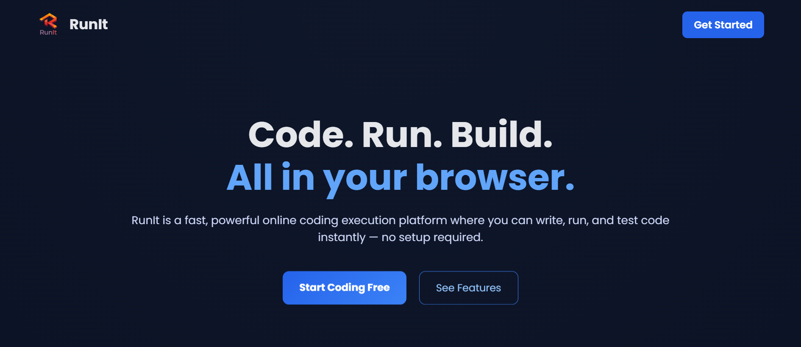
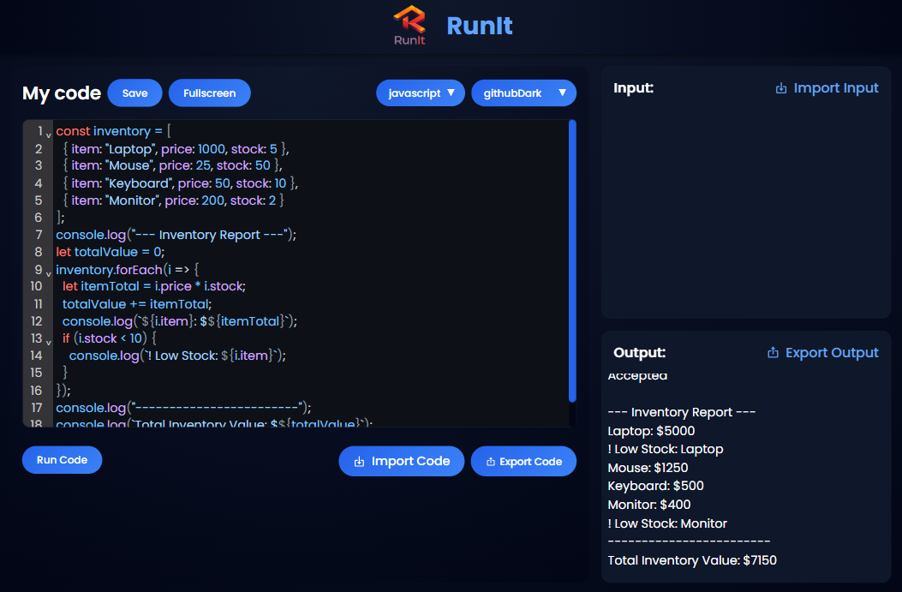
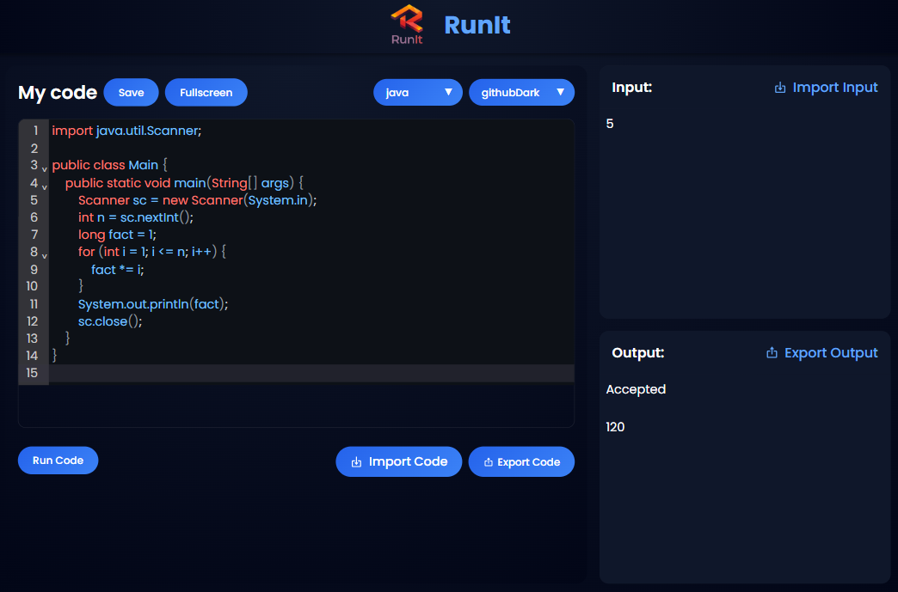

# RunIt | An Online Coding IDE



**RunIt** is an online coding IDE that lets you write and execute code in multiple languages directly in the browser, no setup required.

---

## Demo


---

## Live Demo

[**RunIt**](https://run-it-sigma.vercel.app/)

---

## Motivation

RunIt was built to explore building a full-featured in-browser code editor with React while solving real problems like editor state management, multi-file workflows, and theme customization. The focus was on reducing setup friction and making quick coding and experimentation effortless.

---

## Features

- **Browser-Based IDE**: No installs, no configuration. Just open and code.
- **Multi-Language Support**: Python, JavaScript, Java, and C++.
- **Customizable Themes**: Choose from popular editor themes.
- **Controlled Execution Environment**: Each run executes in a sandboxed environment with resource limits.
- **Project & Playground Management**: Organize code in folders and playgrounds.
- **Import/Export**: Easily import or export code and input/output files.
- **Instant Output**: See results and errors immediately.
- **Perfect for Students, Developers, and Interview Prep**.

---

## Folder Structure

```
src/
	App.js
	index.js
	assets/
		logo.png
	components/
		Modal.jsx
		ModalTypes/
			EditFolder.jsx
			EditPlaygroundTitle.jsx
			Loading.jsx
			NewFolder.jsx
			NewPlayground.jsx
			NewPlaygroundAndFolder.jsx
	context/
		ModalContext.jsx
		PlaygroundContext.jsx
	screens/
		Error404/
		Home/
			Dashboard.jsx
			TopBar.jsx
		MainScreen/
			MainScreen.jsx
		Playground/
			CodeEditor.jsx
			EditorContainer.jsx
			InputConsole.jsx
			OutputConsole.jsx
			Navbar.jsx
	style/
		global.js
public/
	index.html
	manifest.json
api/
	judge.js
```

---

## Tech Stack

- **React** (with hooks & context)
- **Styled-components** for styling
- **CodeMirror** for code editing
- **React Router** for navigation
- **@uiw/codemirror-themes** for themes
- **React Icons** for UI icons

---

## Getting Started

1. **Clone the repo:**

   ```bash
   git clone https://github.com/Harshitpant12/RunIt.git
   cd runit
   ```

2. **Install dependencies:**

   ```bash
   npm install
   ```

3. **Start the app:**

   ```bash
   npm start
   ```

4. Open [http://localhost:3000](http://localhost:3000) in your browser.

---

## Screenshots

- 
- 
- 

---

## Contributing

This is a personal project, but suggestions, issues, and improvements are always welcome.  
Feel free to open an issue or submit a pull request.

---

## Author

**Harshit Pant**

---
